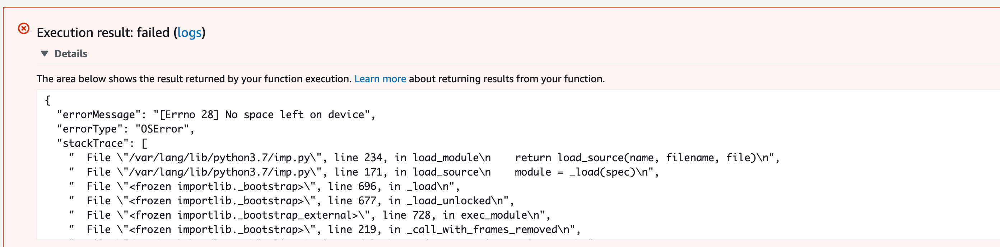

# DKB DevOps Challenge John

This is the result of John Nguyen on the 9.3.2020.
My first attempt was not successful because I wanted to wrap it into an AWS Lambda function by using the [Serverless Framework](https://serverless.com/).
For that, I have created a `serverless.yml`.
AWS Lambda is not the right approach because [Tensorflow](https://www.tensorflow.org/) is too big and even with zipping and sizing, the space on AWS Lambda is not sufficient.


An idea could be to optimize the passed image.

The second attempt is to build a [Flask](https://flask.palletsprojects.com/en/1.1.x/) application.
That would be put into a Dockerfile
Due to the fact, that Tensorflow is running on Python3.7, I have used the [the Buster-slim image](https://github.com/docker-library/python/blob/052eee2625b08d678cd58c71abaad0886a32d4ea/3.7/buster/slim/Dockerfile).

To build a Docker container, run followed commange

```bash
docker build -t dkb:v1 .
```

Run the app

```bash
docker run -d -p 5000:5000 --name dkb dkb:v1
```

The app should be now running on `localhost:5000`.

The next step would be to create a [ALB](https://docs.aws.amazon.com/elasticloadbalancing/latest/application/introduction.html) and [ECS](https://aws.amazon.com/ecs/) on AWS. The image must live in a [ECR](https://console.aws.amazon.com/ecr/home?region=us-east-1#).

Once a ECR is setup, run the push commands

```bash
aws ecr get-login-password --region us-east-1 | docker login --username AWS --password-stdin <id>.dkr.ecr.us-east-1.amazonaws.com/<repo-name>
```

After building, you need to tag and push it

```bash
# Tagging
docker tag dkb:<tag> <id>.dkr.ecr.us-east-1.amazonaws.com/<repo-name>:<tag>

# Pushing
<id>.dkr.ecr.us-east-1.amazonaws.com/<repo-name>:<tag>
```
